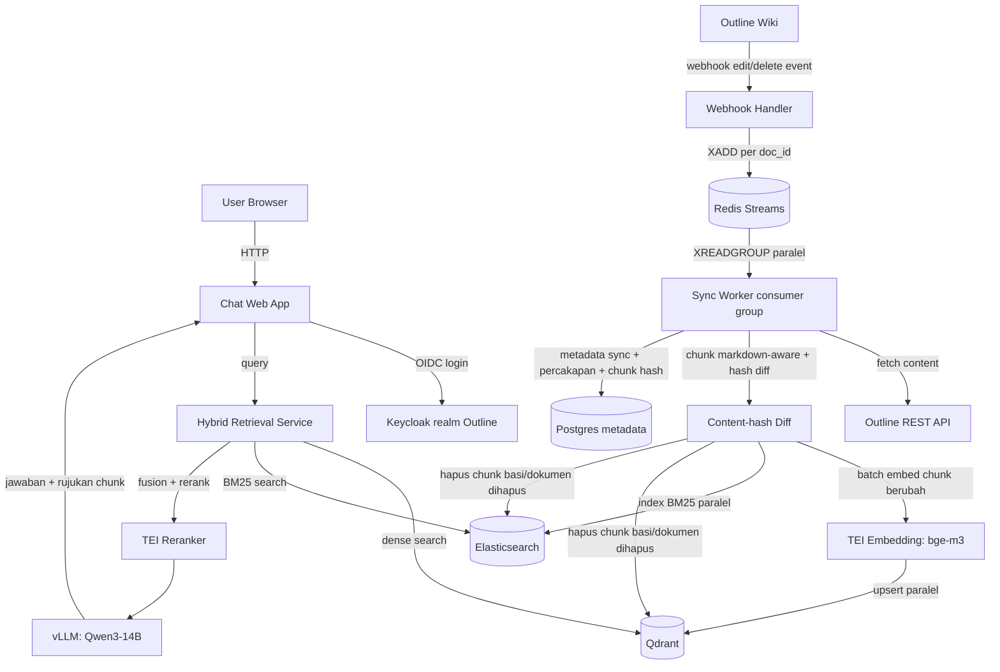

# PRD-001: RAG Assistant untuk Outline Wiki (Self-Hosted Model Stack)

| Field | Isi |
|---|---|
| Kode | PRD-001 |
| Status | Draft |
| Penulis | |
| Tech reviewer | |
| Tanggal dibuat | 2026-07-29 |
| Terakhir diperbarui | 2026-07-29 |
| BRD terkait | Tidak ada |
| FSD turunan | Diisi menyusul |
| Task tracker | Tidak ada |

> **Cara pakai dokumen ini.** PRD mendefinisikan produk dan scope rilisnya. AC detail Given/When/Then tinggal di FSD per fitur, dokumen ini hanya merujuk kodenya.

## 1. Problem Statement & Product Summary

Deployment Outline wiki di [docker-compose-collection/outline](https://github.com/SyahrulApr86/docker-compose-collection/tree/main/outline) (Outline + Keycloak OIDC + Postgres + Redis) tidak punya kapabilitas tanya-jawab atas isi wiki. User harus mencari dan membaca dokumen manual lewat search bawaan Outline, yang hanya mendukung pencocokan kata kunci tanpa pemahaman semantik maupun sintesis jawaban lintas dokumen.

Produk ini menambahkan RAG assistant sebagai layanan terpisah di samping Outline: dokumen di-sync dari Outline API, diindeks ke dua backend pencarian (Qdrant untuk dense retrieval, Elasticsearch untuk BM25/sparse retrieval), digabung lewat hybrid search, lalu dijawab oleh LLM yang berjalan lokal di satu GPU on-premise. Referensi arsitektur diambil dari [molyleaf/outline-rag](https://github.com/molyleaf/outline-rag) (FastAPI, LangChain, pgvector, Redis, SiliconFlow), dengan perubahan mendasar: seluruh model (embedding, reranker, LLM) berjalan self-hosted tanpa API pihak ketiga, vector store memakai dedicated vector database (Qdrant) alih-alih ekstensi pgvector, dan retrieval memakai hybrid dense+sparse alih-alih dense-only.

## 2. Product Goal & Non-goal

**Goal:** User Outline bisa bertanya dalam bahasa natural dan mendapat jawaban yang disintesis dari isi wiki, lengkap dengan rujukan yang menunjukkan persis dokumen dan chunk sumbernya, tanpa data atau query keluar dari infrastruktur sendiri.

**Non-goal:**
- Tidak mengubah editor atau struktur data Outline itu sendiri.
- Tidak menyediakan write-access dari chat ke Outline (tidak ada auto-edit dokumen dari jawaban LLM).
- Tidak menggantikan Outline search bawaan, keduanya coexist.
- Tidak menyasar multi-tenant lintas instance Outline. Satu deployment RAG melayani satu instance Outline.
- Tidak menyasar multi-GPU. Seluruh model inference berjalan di satu GPU.

## 3. Target User & Persona

| Persona | Konteks kerja | Kebutuhan utama |
|---|---|---|
| Wiki contributor | Menulis dan mengedit dokumen di Outline sehari-hari | Menemukan dokumen terkait dan jawaban cepat tanpa membuka banyak tab |
| Wiki reader / new joiner | Mengonsumsi dokumentasi, tidak familiar struktur wiki | Tanya jawab natural language, dengan kemampuan menelusuri persis chunk/dokumen mana yang dipakai sebagai rujukan |
| Platform operator | Mengelola infrastruktur self-hosted (GPU, Qdrant, Elasticsearch) | Model dan data tidak keluar jaringan internal, ops via docker compose |

## 4. Success Metrics

| Jenis | Metrik | Baseline | Target | Cara ukur |
|---|---|---|---|---|
| North star | Jawaban chat mengandung rujukan yang valid dan bisa ditelusuri ke chunk/dokumen sumber yang benar-benar relevan | Tidak ada (fitur belum ada) | Sample manual per rilis, mayoritas jawaban tersitasi benar | Review manual sample query oleh tim internal |
| Guardrail | Tidak ada request atau isi dokumen yang keluar ke API pihak ketiga | Tidak berlaku (baseline nol karena stack lama pakai SiliconFlow) | Nol panggilan keluar ke endpoint LLM/embedding eksternal | Audit network egress dari container RAG |
| Guardrail | Waktu dokumen searchable di Qdrant dan Elasticsearch setelah webhook edit diterima | Tidak ada | Di bawah 10 detik | Log timestamp webhook vs timestamp index selesai |

## 5. Release Scope

| Kapabilitas | Rilis | Alasan |
|---|---|---|
| Sync dokumen dari Outline (API + webhook) | MVP | Prasyarat semua kapabilitas lain |
| Markdown-structure-aware chunking | MVP | Kualitas retrieval bergantung langsung ke chunking |
| Embedding (BAAI/bge-m3) dan reranker (BAAI/bge-reranker-v2-m3) self-hosted lewat TEI | MVP | Syarat utama produk: tidak ada API pihak ketiga |
| LLM chat self-hosted (Qwen3-14B lewat vLLM) | MVP | Syarat utama produk, footprint VRAM kecil menyisakan ruang untuk embedding dan reranker di GPU yang sama |
| Dense retrieval via Qdrant | MVP | Dedicated vector database, menggantikan pgvector di referensi arsitektur |
| Sparse retrieval via Elasticsearch (BM25) dan hybrid fusion | MVP | Kapabilitas baru yang diminta eksplisit |
| Panel rujukan yang menunjukkan chunk/dokumen persis yang dipakai LLM untuk tiap jawaban | MVP | Transparansi retrieval, supaya kualitas jawaban bisa diverifikasi langsung ke sumbernya |
| Penghapusan index otomatis (Qdrant dan Elasticsearch) saat dokumen dihapus atau di-trash di Outline | MVP | Index tidak boleh menyimpan rujukan ke dokumen yang sudah tidak ada |
| Login chat via Keycloak OIDC (reuse realm Outline) | MVP | Deployment ini sudah pakai Keycloak, bukan GitLab seperti referensi |
| Intent routing (Query/Creative/Roleplay/General) | Fase 2 | Nice-to-have dari referensi, bukan inti masalah yang dipecahkan |
| Query rewriting multi-turn dengan riwayat percakapan | Fase 2 | Menambah kompleksitas prompt, tidak blocking MVP |
| Evaluasi retrieval otomatis (RAG eval harness) | Fase 2 | Perlu dataset uji yang belum ada |

## 6. Epic & User Story

| Kode | Epic | User story | Prioritas |
|---|---|---|---|
| US-01 | Sync dan indexing | Sebagai operator, saya ingin dokumen Outline otomatis ter-index ulang dalam hitungan detik setelah diedit, supaya jawaban chat selalu berdasar versi terbaru. | Must |
| US-02 | Hybrid retrieval | Sebagai wiki reader, saya ingin hasil pencarian mempertimbangkan makna semantik maupun kecocokan istilah persis (nama produk, kode, singkatan), supaya query teknis maupun konsep tetap ketemu. | Must |
| US-03 | Rujukan yang tertelusuri | Sebagai wiki reader, saya ingin melihat persis chunk dan dokumen mana yang dipakai LLM untuk menyusun jawaban, supaya saya bisa verifikasi ke dokumen asli. | Must |
| US-04 | SSO reuse | Sebagai wiki contributor, saya ingin login ke chat pakai akun Keycloak yang sama dengan Outline, supaya tidak perlu akun terpisah. | Must |
| US-05 | Self-hosted inference | Sebagai platform operator, saya ingin semua model (embedding, rerank, chat) berjalan di satu GPU on-premise, supaya tidak ada data wiki yang terkirim ke API eksternal. | Must |
| US-06 | Kebersihan index | Sebagai operator, saya ingin index di Qdrant dan Elasticsearch otomatis terhapus saat dokumen sumbernya dihapus atau di-trash, supaya chat tidak merujuk dokumen yang sudah tidak ada. | Must |

AC detail per story ditulis di FSD masing-masing, dirujuk lewat kodenya.

## 7. User Flow & Wireframe

Wireframe layout: tidak berlaku, UI chat mengikuti pola single-page chat window yang sudah ada di referensi arsitektur (input box, riwayat percakapan), ditambah panel rujukan yang menampilkan potongan chunk sumber per jawaban.

## 8. Functional Requirements

| Kode | Kebutuhan | User story terkait |
|---|---|---|
| FR-01 | Sistem menarik daftar dokumen dan collection dari Outline API menggunakan token API, dan menerima webhook saat dokumen dibuat, diubah, dipindah, dihapus, atau di-trash. | US-01 |
| FR-02 | Sistem memverifikasi signature webhook Outline sebelum memproses event. | US-01 |
| FR-03 | Sistem memecah dokumen (chunking) dengan mempertimbangkan struktur heading Markdown, bukan hanya batas karakter tetap. | US-01, US-02 |
| FR-04 | Sistem membuat embedding dense untuk tiap chunk memakai BAAI/bge-m3 yang berjalan self-hosted lewat TEI, dan menyimpannya di Qdrant. | US-01, US-05 |
| FR-05 | Sistem mengindeks tiap chunk yang sama ke Elasticsearch untuk pencarian BM25/sparse. | US-01, US-02 |
| FR-06 | Sistem menjalankan retrieval dari Qdrant dan Elasticsearch secara paralel per query, lalu menggabungkan hasil keduanya (hybrid fusion) sebelum reranking. | US-02 |
| FR-07 | Sistem melakukan reranking atas hasil hybrid retrieval memakai BAAI/bge-reranker-v2-m3 self-hosted lewat TEI, sebelum dikirim ke LLM sebagai context. | US-02, US-05 |
| FR-08 | Sistem menghasilkan jawaban chat memakai Qwen3-14B self-hosted lewat vLLM, dengan rujukan eksplisit ke dokumen sumber pada tiap klaim yang diambil dari context. | US-03, US-05 |
| FR-09 | Untuk tiap rujukan pada jawaban, sistem menampilkan isi chunk persis yang dipakai (bukan hanya nama dokumen), sehingga user bisa memverifikasi tanpa membuka dokumen asli. | US-03 |
| FR-10 | User login ke chat lewat Keycloak OIDC realm yang sama dengan Outline, tanpa akun terpisah. | US-04 |
| FR-11 | Sistem tidak melakukan panggilan API ke penyedia LLM/embedding pihak ketiga mana pun untuk fitur inti (embedding, rerank, chat). | US-05 |
| FR-12 | Sistem menghapus entry Qdrant dan Elasticsearch yang bersesuaian saat dokumen sumbernya dihapus permanen maupun dipindah ke trash di Outline. | US-01, US-06 |
| FR-13 | Sistem menyimpan metadata percakapan dan status sync di Postgres biasa (tanpa ekstensi pgvector, karena vector disimpan di Qdrant). | US-01 |
| FR-14 | Sistem memakai Redis Streams dengan consumer group sebagai antrean event sync (bukan queue list sederhana), pada instance Redis terpisah dari Redis Outline, sehingga worker bisa berjalan paralel dan event yang gagal diproses bisa di-retry otomatis lewat claim ulang. | US-01 |
| FR-15 | Sistem melakukan debounce per dokumen (bukan debounce global lintas dokumen) dengan window pendek, untuk menggabungkan webhook beruntun dari autosave dokumen yang sama tanpa menunda pemrosesan dokumen lain. | US-01 |
| FR-16 | Sistem menghitung hash tiap chunk hasil chunking dan membandingkannya dengan hash versi sebelumnya, hanya membuat embedding ulang untuk chunk yang hash-nya berubah. | US-01 |
| FR-17 | Sistem menghapus entry chunk yang tidak lagi muncul di versi terbaru dokumen (bagian yang dihapus dari isi dokumen, bukan hanya saat dokumen utuh dihapus). | US-01, US-06 |
| FR-18 | Sistem mengirim seluruh chunk yang berubah dalam satu batch call ke TEI embedding, dan menulis hasilnya ke Qdrant dan Elasticsearch secara paralel. | US-01 |

## 9. Non-Functional Requirements

| Kode | Aspek | Threshold | Sumber |
|---|---|---|---|
| NFR-01 | VRAM budget | Qwen3-14B (Q4, sekitar 8,3 GB), TEI embedding (bge-m3), dan TEI reranker (bge-reranker-v2-m3) berjalan bersamaan di satu GPU (RTX 5090, 32 GB). | Keputusan model pada percakapan produk ini. |
| NFR-02 | Data residency | Tidak ada isi dokumen, query user, atau embedding yang dikirim ke endpoint di luar jaringan internal deployment. | Requirement eksplisit self-hosted dari percakapan produk ini. |
| NFR-03 | Ops footprint | Seluruh komponen baru (sync worker, retrieval service, TEI, vLLM, Qdrant, Elasticsearch, Redis Streams) dijalankan lewat docker compose, konsisten dengan pola deployment [docker-compose-collection](https://github.com/SyahrulApr86/docker-compose-collection). | Konvensi deployment yang sudah berjalan di repo tersebut. |
| NFR-04 | Latensi index ulang | Dokumen searchable di Qdrant dan Elasticsearch dalam waktu di bawah 10 detik setelah webhook edit diterima. | Keputusan produk pada percakapan ini, dicapai lewat Redis Streams, debounce per dokumen, content-hash diffing, dan batch embedding (FR-14 sampai FR-18). |

## 10. Dependency & Assumption

Dependency:
- Deployment Outline + Keycloak di [docker-compose-collection/outline](https://github.com/SyahrulApr86/docker-compose-collection/tree/main/outline) harus sudah berjalan dan realm Keycloak-nya bisa menerbitkan client OIDC baru untuk aplikasi chat.
- Outline API token dengan scope baca dokumen dan collection.
- GPU host dengan CUDA driver yang kompatibel dengan runtime serving model yang dipilih (vLLM, TEI).

Asumsi:
- Asumsi: Kapasitas resource Qdrant dan Elasticsearch (CPU, RAM, disk) tidak dibatasi eksplisit di awal, arsitektur harus siap scale out kalau volume dokumen bertambah, bukan diasumsikan cukup dengan single-node permanen.
- Asumsi: Qdrant dan Elasticsearch berjalan di host yang sama dengan Postgres Outline yang sudah ada, bukan host terpisah.

## 11. Release Plan & Milestone

| Milestone | Cakupan | Target |
|---|---|---|
| M1 | Sync worker + chunking + dense index (Qdrant) + LLM self-hosted (Qwen3-14B), chat tanpa Elasticsearch | Menunggu penjadwalan |
| M2 | Elasticsearch index + hybrid fusion + reranker, menggantikan dense-only retrieval M1 | Menunggu penjadwalan |
| M3 | Panel rujukan chunk, penghapusan index otomatis saat delete/trash, login Keycloak OIDC terintegrasi, rilis MVP lengkap | Menunggu penjadwalan |

## 12. Risiko dan Mitigasi

| # | Risiko | Dampak | Mitigasi |
|---|---|---|---|
| 1 | Tiga model (chat, embedding, reranker) berbagi satu GPU (RTX 5090, 32 GB) | Throughput turun saat load bersamaan, terutama saat traffic chat dan reindexing besar terjadi bersamaan | Qwen3-14B Q4 (~8,3 GB) dipilih spesifik karena footprint kecil, menyisakan headroom untuk TEI embedding, reranker, dan KV cache |
| 2 | Dua backend search baru (Qdrant, Elasticsearch) menambah komponen ops yang belum ada di stack Outline saat ini | Beban operasional bertambah (monitoring, resource, patching) dibanding referensi yang hanya pakai pgvector | Kedua service dijalankan lewat docker compose konsisten dengan pola deployment yang sudah ada, arsitektur disiapkan scale-ready dari awal (lihat asumsi bagian 10) |
| 3 | Target index ulang di bawah 10 detik mengharuskan pipeline per dokumen, bukan batch debounce seperti referensi | Beban sync worker lebih tinggi saat banyak dokumen diedit bersamaan (misal bulk import) | Sync worker memproses per dokumen segera, dengan antrean (queue) untuk menampung lonjakan tanpa memperlambat dokumen individual |
| 4 | Kualitas jawaban Qwen3-14B secara mentah lebih rendah dibanding model hosted besar (referensi pakai model seperti DeepSeek V3.2, Kimi K2 lewat SiliconFlow) | Jawaban berpotensi kurang akurat dibanding baseline referensi | Kompensasi lewat kualitas retrieval (hybrid search, reranking, chunking markdown-aware, panel rujukan chunk untuk verifikasi), bukan lewat ukuran model |

## 13. Dokumen Turunan

| Dokumen | Cakupan | URL |
|---|---|---|
| FSD-XXX | Sync worker, chunking pipeline, dan penghapusan index saat delete/trash | Diisi menyusul |
| FSD-XXX | Hybrid retrieval (Qdrant + Elasticsearch fusion dan reranking) | Diisi menyusul |
| FSD-XXX | Model serving self-hosted (vLLM Qwen3-14B, TEI bge-m3, TEI bge-reranker-v2-m3) | Diisi menyusul |
| FSD-XXX | Chat UI, panel rujukan chunk, dan integrasi Keycloak OIDC | Diisi menyusul |

## 14. Open Questions

Tidak berlaku. Tidak ada keputusan yang masih menggantung di luar yang sudah tercakup di bagian desain.
