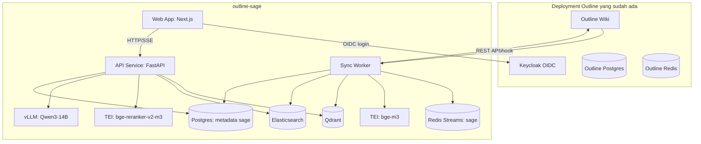
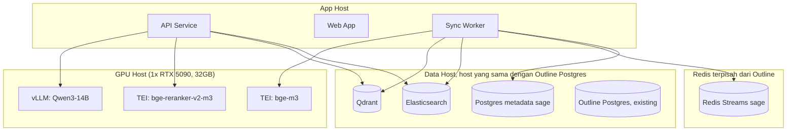
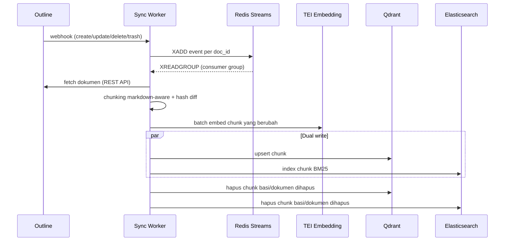
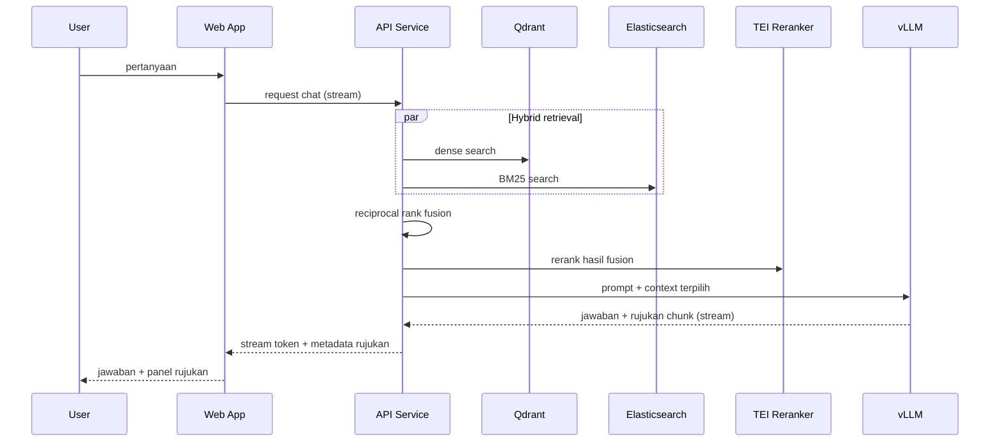

# HLD-001: Outline-Sage System Architecture

| Field | Isi |
|---|---|
| Kode | HLD-001 |
| Status | Draft |
| Penulis | |
| Tanggal dibuat | 2026-07-29 |
| Terakhir diperbarui | 2026-07-29 |
| Tech reviewer | |
| Menggantikan | Tidak ada |
| Digantikan oleh | Tidak ada |
| PRD terkait | `docs/business/PRD-001_outline-sage.md` |
| Task tracker | Tidak ada |

> **Cara pakai dokumen ini.** HLD mendefinisikan arsitektur sistem secara menyeluruh: batas komponen, pilihan teknologi, dan topologi deployment. Rancangan detail per komponen (kontrak API, skema data, test strategy) ada di TSD masing-masing, dokumen ini hanya merujuk kodenya. Bagian yang tidak relevan ditulis `Tidak berlaku` beserta alasannya.

## 1. System Context

Outline-sage adalah layanan RAG yang berdiri di samping deployment Outline wiki di [docker-compose-collection/outline](https://github.com/SyahrulApr86/docker-compose-collection/tree/main/outline) (Outline + Keycloak OIDC + Postgres + Redis). Outline-sage tidak mengubah Outline itu sendiri, hanya mengonsumsi API dan webhook-nya, lalu menyajikan chat terpisah yang menjawab pertanyaan berdasar isi wiki.

Scope produk, persona, dan metrik sukses ada di `docs/business/PRD-001_outline-sage.md`. Dokumen ini hanya menerjemahkan scope itu menjadi arsitektur teknis.

**Non-goal:** Detail kontrak API, skema database, dan algoritma per komponen. Itu ada di TSD-001 (sync dan indexing), TSD-002 (retrieval dan chat), TSD-003 (frontend).

## 2. Component Overview

| Komponen | Tanggung jawab | Tidak bertanggung jawab atas |
|---|---|---|
| Web App (Next.js) | UI chat, panel rujukan chunk, login OIDC, streaming jawaban | Retrieval, akses langsung ke Qdrant/ES/model |
| API Service (FastAPI) | Endpoint chat, orkestrasi hybrid retrieval, rerank, generasi jawaban lewat LLM | Sync dokumen dari Outline |
| Sync Worker (FastAPI/Python, proses terpisah) | Konsumsi webhook Outline, chunking, embedding, dual-write index | Melayani request chat |
| Redis Streams (sage) | Antrean event sync, terpisah dari Redis Outline | Cache session, cache LLM |
| Qdrant | Dense vector index | Full-text/BM25 |
| Elasticsearch | Sparse/BM25 index | Vector similarity |
| Postgres metadata (sage) | Riwayat percakapan, status sync, chunk hash | Vector store (bukan pgvector) |
| TEI (embedding, reranker) | Inference embedding dan reranking | Generasi jawaban |
| vLLM | Inference LLM chat | Retrieval |

Rancangan detail Sync Worker ada di TSD-001. Rancangan detail API Service (retrieval dan chat) ada di TSD-002. Rancangan detail Web App ada di TSD-003.

## 3. Technology Stack & Rationale

| Layer | Pilihan | Kenapa |
|---|---|---|
| Backend API dan sync worker | Python, FastAPI, async | Ekosistem LangChain dan SDK Qdrant/Elasticsearch/TEI/vLLM matang di Python. Traffic internal satu instance wiki tidak butuh raw throughput yang jadi keunggulan Go. |
| Frontend | Next.js, Vercel AI SDK, shadcn/ui | Vercel AI SDK dan Next.js open source dan self-hostable (bukan lock-in ke platform hosting Vercel), ekosistem streaming chat dan tool-call paling matang saat ini, komponen chat (assistant-ui, shadcn) siap pakai untuk citation panel interaktif. |
| Dense vector store | Qdrant | Dedicated vector database, HNSW dan quantization lebih matang dibanding ekstensi pgvector, menggantikan pgvector di referensi arsitektur. |
| Sparse index | Elasticsearch | BM25 untuk query berbasis istilah persis (nama produk, kode, singkatan) yang lemah di pencarian dense murni. |
| Antrean sync | Redis Streams, instance terpisah dari Redis Outline | Consumer group untuk paralelisme dan retry otomatis, terpisah dari Redis Outline supaya kebijakan eviction dan persistence tidak bentrok (cache session butuh eviction, queue butuh durability). |
| Metadata relasional | Postgres, instance baru (tanpa ekstensi pgvector) | Riwayat percakapan dan status sync tidak butuh vector store karena vector sudah di Qdrant. |
| Embedding dan reranker | BAAI/bge-m3, BAAI/bge-reranker-v2-m3, diserve lewat TEI (text-embeddings-inference) | Model yang sama dipakai referensi arsitektur, terbukti solid multilingual. TEI memberi dynamic batching native. |
| LLM chat | Qwen3-14B (Q4), diserve lewat vLLM | Footprint VRAM kecil (~8,3 GB) menyisakan ruang untuk embedding dan reranker di GPU yang sama. Kualitas retrieval (chunking, hybrid search, reranking) jadi penentu utama kualitas jawaban, bukan ukuran LLM. |
| Autentikasi | Keycloak OIDC, reuse realm Outline yang sudah ada | Deployment target sudah pakai Keycloak, bukan GitLab seperti referensi arsitektur. |

Referensi arsitektur retrieval dan sync diadaptasi dari [molyleaf/outline-rag](https://github.com/molyleaf/outline-rag). Repo itu berlisensi Business Source License 1.1: boleh dipelajari polanya, tidak boleh di-fork kodenya langsung ke proyek ini. Web App dan API Service ditulis fresh.

## 4. Deployment Topology

Seluruh komponen dijalankan lewat docker compose, konsisten dengan pola deployment [docker-compose-collection](https://github.com/SyahrulApr86/docker-compose-collection). Qdrant, Elasticsearch, dan Postgres metadata sage berbagi host yang sama dengan Postgres Outline. Kapasitas resource tidak dibatasi eksplisit di awal.

## 5. Data Flow

### 5.1 Ingestion (sync)

Detail lengkap ada di TSD-001.

### 5.2 Query (chat)

Detail lengkap ada di TSD-002 (retrieval dan chat) dan TSD-003 (rendering di Web App).

## 6. Quality Attributes

| Atribut | Pernyataan | Detail threshold |
|---|---|---|
| Data residency | Tidak ada isi dokumen, query, atau embedding yang keluar ke API pihak ketiga | PRD-001 NFR-02 |
| Latensi index ulang | Dokumen searchable di bawah 10 detik setelah webhook diterima | PRD-001 NFR-04, detail mekanisme di TSD-001 |
| VRAM budget | Qwen3-14B, TEI embedding, TEI reranker berjalan bersamaan di satu GPU 32 GB | PRD-001 NFR-01, alokasi detail di TSD-002 |
| Ops footprint | Seluruh komponen baru dijalankan via docker compose | PRD-001 NFR-03 |

## 7. Rejected Alternatives

| Alternatif | Kenapa tidak dipilih |
|---|---|
| Backend Go | Ekosistem RAG (text splitter, connector Qdrant/Elasticsearch, klien reranker/embedding) jauh lebih matang di Python. Traffic internal tidak butuh keunggulan concurrency Go. |
| pgvector (menyambung ke Postgres Outline) | Diminta eksplisit dedicated vector database untuk kualitas HNSW dan quantization yang lebih baik dibanding ekstensi pgvector. |
| Fork langsung UI dari molyleaf/outline-rag | Repo tersebut berlisensi Business Source License 1.1, forking kode UI-nya ke proyek baru berisiko melanggar lisensi. |
| Debounce global lintas dokumen (pola webhook watcher referensi) | Tidak bisa memenuhi target index ulang di bawah 10 detik saat ada dokumen lain yang sedang aktif diedit. Diganti debounce per dokumen, detail di TSD-001. |

## 8. Open Questions

Tidak berlaku. Keputusan arsitektur pada level ini sudah final berdasar PRD-001. Pertanyaan yang tersisa bersifat detail implementasi dan ada di TSD masing-masing.
